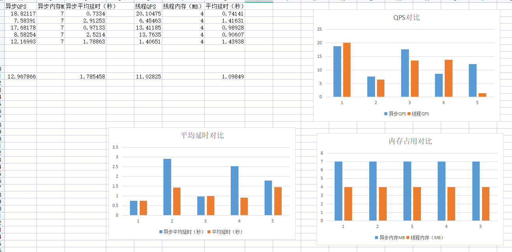
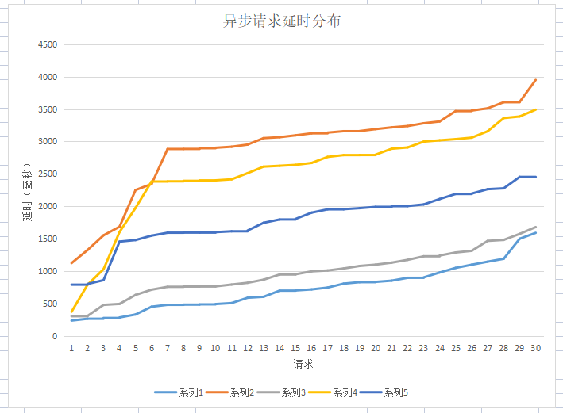
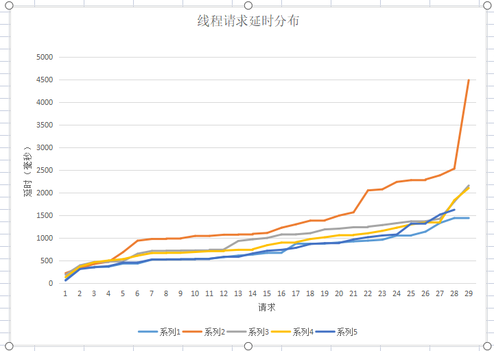

# 1.观看赵方亮和廖东海的报告视频
# 2. 参加异步项目第一次视频会议
# 2.安装开发环境
  以前是用Vmware虚拟机做的rcore和arceos，感觉计较慢也不太方便。安装wsl2上的rust开发环境，进行爬虫程序开发。
# 3.使用AI生成一个爬虫程序进行研究
  我先用AI生成了一个基于爬虫程序，研究其代码，初步了解爬虫程序原理。
# 4.收集爬虫程序开发素材
  收集一些代码片段作为开发素材，例如：异步读写文件；程序运行计时；获取当前进程内存；计算Qps。主要是用AI生成这些代码片段。
# 5.实际编写爬虫程序
实际编写异步爬虫程序（crawler_async），然后改造成多线程线程爬虫（crawler_thread），并爬取高校网站。**基于线程的比异步内存占用少3MB**，性能好像差不多，可能受网络影响更大，线程的好像更好一些。下一步打算再优化一下程序。

# 