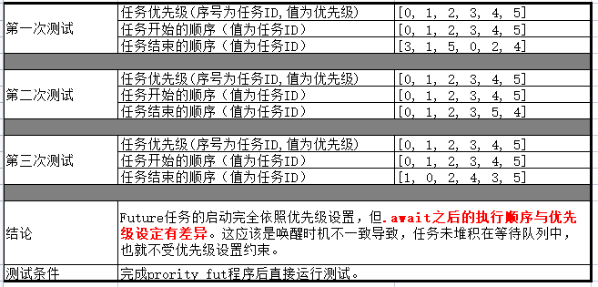
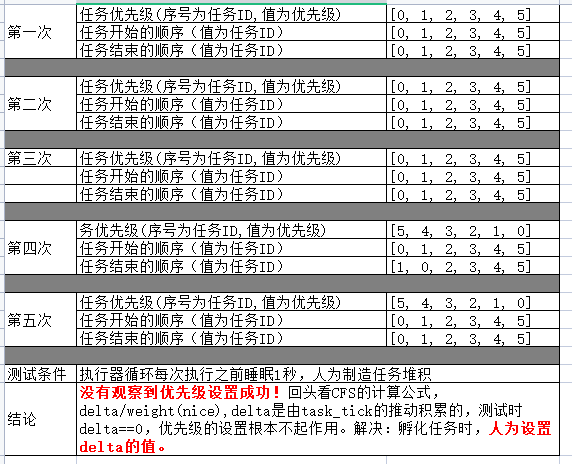
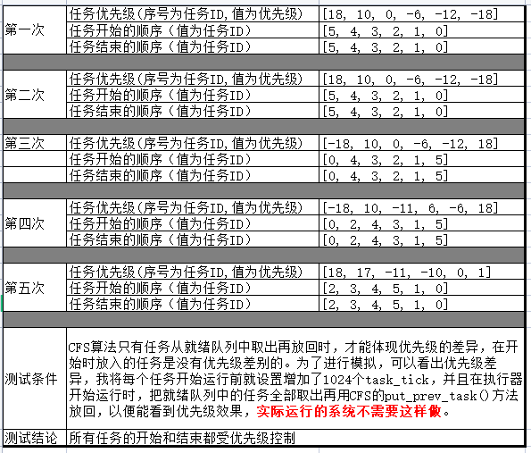

# 1. 《rust语言圣经》剩余部分 - 已读完
# 2. 阅读《Futures Explained in 200 Lines of Rust》- 已完成
# 3. 任务2实践任务 - 已完成
## （1）设计思路
1. 程序主要来源于《rust语言圣经》的异步章节的执行器代码的架构。
2. 从《Futures Explained in 200 Lines of Rust》中拿来Parker的代码。在《rust语言圣经》原本依靠通道来阻塞执行器，axsched中的CFScheduler没有类似阻塞机制，我用Parker实现执行器阻塞。
3. 调度算法我使用了[arceos的CFS调度算法](https://github.com/arceos-org/axsched)，将其移植到异步执行器中，作为异步调度算法。
## （2）存在问题及解决思路
1. 定时器问题：CFS原本是用于OS中，它**依赖OS的定时器timer**周期性推动task_tick，通过周期性的**单个原子操作**就能度量任务执行时间；执行器中没有这样方便的机制，要么度量不准确，要么计时消耗大。在这一程序中，我是每次执行特定任务时推动执行一次tiask_tick，这对于短促运行的任务还可以，但对于单次运行较长时间的任务，计量效果较差。我也考虑过通过标准库的Instant.elapsed进行计量，但与一个原子操作相比，这样操作系统消耗较大，与使用协程的目的不符。实际使用时应该还是依赖OS内核提供的计时器。
2. axsched create只是对外暴漏了BaseScheduler trait的几个方法，对于在异步环境中使用，可能需要把CFS算法直接引入项目进行修改扩展。
3. 连续运行与阻塞问题：**CFS在内核中是连续运行**的，在推动task_tick时总可以得到一个正在运行的当前任务；但**异步执行器却可能处于被阻塞状态**，没有任何Future正在运行，也就没有当前任务。解决思路：（我的代码未实现）可以仿照内核的Idle任务，给执行器添加“当前任务”的成员，当执行器阻塞前，将“当前任务”设置为Idle任务，当task_tick发现“当前任务”为Idle时，直接跳过。
4. 优先级差异显现问题：CFS时为长期运行的系统设计的，在调度器刚**启动时**所有任务是**平权**的，**优先级**是在计时器的不断迭代中**逐渐显现**。而对于**只有一个.await的Future**（我的代码中使用）来说，完全体现不出优先级差异。为此我做了一些特殊处理：每个任务创建后，先增加1024个task_tick；执行器在运行前，将所有任务先从就绪队列中取出，再放回，因为CFS只有将前面取出的任务放回就绪队列时才会设置优先级权重。**这两个操作不是异步执行器必须的，这里只是为了提前显现结果。**

## （3）代码链接

[priority_fut具有优先级的异步执行器代码](task2/code/priority_fut/)

## （4）测试结果
1. 初次执行：可以看到结果顺序不稳定，应该是唤醒时刻差异导致

	
	
2. 让执行器每轮执行前睡眠1秒，人为制造就绪队列中任务堆积，再进行测试。可以看到**优先级设置未显现**（前面“存在问题”中解释过）。

		

3. 为任务预制task_tick，并且执行器运行前将就绪队列中任务取出再放回。可以看到**运行完全服从优先级设置**。

	

# 4. 下周计划
1. 开始阅读embassy文档。
2. 开始任务3实践任务。
# 5. 问题
1. 为完成任务3是否有必要读完《embassy文档》的所有内容？中文版和英文版有多大差异，只读中文版是不是足够了？
2. 要做一个基于协程的调度器，应该从哪里开始？
3. 向老师曾经提到有人已经将硬实时调度算法从C转成rust，有这方面的资料和链接吗？