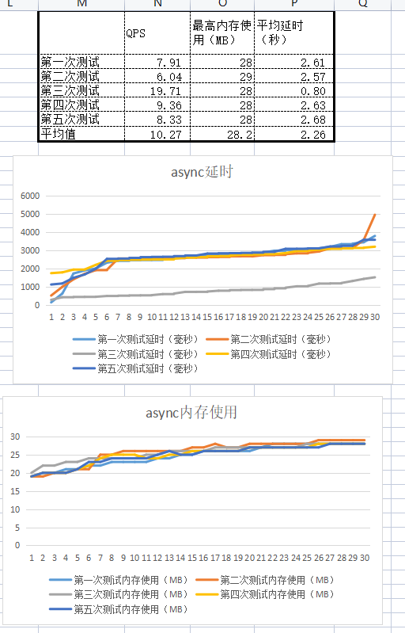
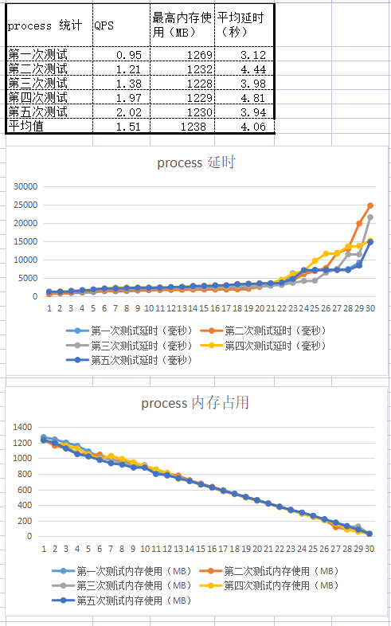
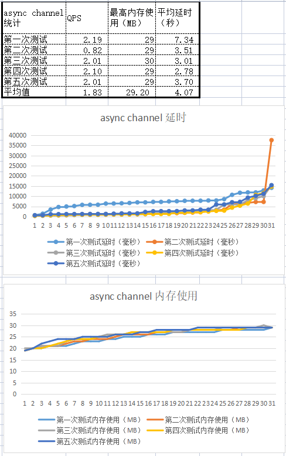
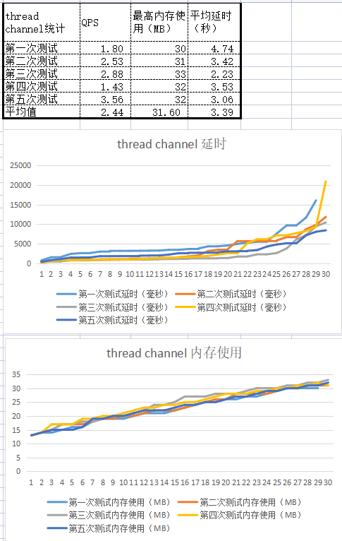
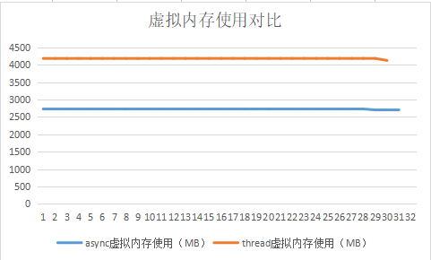

# 1.修复内存使用统计方式
  我上周的爬虫在统计内存使用时，只是在程序开始和结束时统计了内存使用，结果中未包含程序执行中分配后又回收的内存，不准确。添加请求执行过程中进程内存使用统计。

  [crawler_async异步爬虫代码](task1/code/crawler_async_no_channel/) 

  使用异步时的结果：

  

  [crawler_thread线程爬虫代码](task1/code/crawler_thread_no_channel/) 

  使用线程时的结果：

  

# 2.多进程爬虫
  将单个请求的处理分离为独立rust程序curl_one（类似curl），然后从父进程crawler_process进行并发调用，并统计所有子进程的内存使用。

  [curl_one处理单个请求代码](task1/code/curl_one/)

  [crawler_process多进程爬虫代码](task1/code/crawler_process/)

  下面是多进程统计结果：
  
  

# 3.分离请求和响应存储过程
  将结果存盘过程从请求的异步协程或线程中分离出来，单独进行存储处理，响应文本通过channel进行传递。

  [crawler_async异步爬虫代码](task1/code/crawler_async/)

  分离请求和存储后异步的统计结果：

  

  [crawler_thread线程爬虫代码](task1/code/crawler_thread/)

  分离请求和存储后多线程的统计结果：

  

# 4. 比较异步和多线程虚拟内存申请
  在前面做的结果中，可以看到协程的虚拟内存申请500多兆，比线程方式多很多。实际物理内存只使用了很少，应该是只map未实际映射的内存。
  下面是运行期间的虚拟内存申请：

  

# 4.爬虫程序总结
1. 爬虫的性能受网络状况影响比较大，不太好比较，但在内存使用方面可以看到一些有意思的结果。
2. 我在上周末的爬虫程序只是在运行开始和结束时统计内存使用，结果是是固定值。异步的物理内存/虚拟内存是8MB/548MB；多线程物理内存/虚拟内存是4MB/15MB。这应该是本底的代码和全局变量的占用，不不包含协程和多线程分配的物理内存。异步稍多，应该是tokio多出的代码。
3. 当我增加请求期间的内存使用统计后，可以看到：
	1. 异步和多线程的内存使用是逐渐增长的。
	2. 无论使用通道前和使用后都可以看到，**线程内存使用相对异步的斜率较大**，也就是**线程比异步内存使用增长更快**，这可能代表了线程中栈的占用。
	3. 多进程是开始很高（1GB），然后逐渐下降，基本是**线性向下倾斜**的。这说明多线程并发孵化时内存暴涨，然后随着不断有请求处理结束，子进程退出释放自己的内存，使整体内存使用明显下降，直到所有子进程内存释放。
4. 看到异步分配较多的初始虚拟内存(528MB)，我又统计了运行期间虚拟内存的申请，可以看到线程是协程的1.5倍左右。
# 5.阅读王文智论文《轻量级操作系统调度单位的设计与实现》
1. 这篇论文中介绍了一些我不了解的基础知识，读一读还是有不少帮助的。
2. 论文中实现的调度器需要建立位图，在内核与每个应用间要建立共享内存页，所有应用都需要特殊编译。效率不高，也没有通用性，安全性也是问题。
# 6. 学习《rust语言圣经》有关异步的章节
1. 已经看了大约2/3，估计再用一两天可以看完。
2. 我基本了解future的大体运行机制，但有限概念还有些模糊。例如，MIO是怎么进行通知的。
# 7.下周计划
1. 用一两天时间阅读完《rust圣经》异步协程剩余的部分。
2. 阅读[200行实现协程（books-futures-explained）](https://github.com/blandger/books-futures-explained/releases/tag/0.0.1)和[tokio中文 深入futures](https://tokio-zh.github.io/document/going-deeper/futures.html) 。应该和前面《rust圣经》有重叠部分，我不确定读完它们要用多长时间。
3. 开始任务2的实践任务
# 5. 疑问
1. 可以看到线程和异步的物理内存分配是不断增长的，它们向上增长而没有下降的波动缺口应该是同一地址空间不断缺页异常处理的结果，并且没有进行unmap操作。但在所有子线程/协程退出后突然下降到本底的4MB/8MB，说明这时统一进行了内存unmap，**这一unmap时机是怎么确定的？是编译器决定的吗？这是不是也算某种GC？**
2. 在阅读《rust语言圣经》中的异步章节时，提到协程的有效使用需要MIO的支持，但我在arceos中没有找到mio，是在其它模块内部吗？  **解答**：arceos还未实现多路复用IO机制。
3. 我不太清楚任务2的实践任务该怎么做？做什么？。 **解答**: 前半部分是写一个阅读文件综述；后半部分是实现优先级的协程调度。
4. 读了王文智的论文，我有个疑惑，**为什么需要一个对协程的全局调度器？** 我觉得异步的执行器/运行时本质上就是调度器，它可以调度线程内协程的执行；而现有内核的调度器（如arceos）是以线程为调度单位的。它们可以分工合作，各司其职，在线程的时间片内由协程的执行器/运行时负责调度协程执行，时间片以外由内核调度器负责根据优先级切换线程，这不是挺完美吗？  **解答**：当一个CPU内的线程的协程特别繁忙，而另一个CPU空闲时，调度整个线程到另一颗CPU，只会造成第二个CPU繁忙而第一个空闲，不能解决问题，这是就有必要对线程的协程进行细粒度的调度，将繁忙线程的协程调度到不同CPU上执行，以提高执行效率。 
5. 在《rust圣经》中说，为了防止自引用问题，Future都是被**Pin住**的；但后面又说，当使用多线程Future执行器时，Future可能在**线程间被移动**。这两种说法是不是矛盾的？ **解答**：Pin住的Future是在堆内，在整个生命周期内都能固定住，Future可以在线程之间移动，但在内存中未移动。在函数的生命周期内栈会不断压栈和弹出，是临时性的，放在栈中的内容，在函数退出后会被清空，栈中的内容固定不住。
# 
