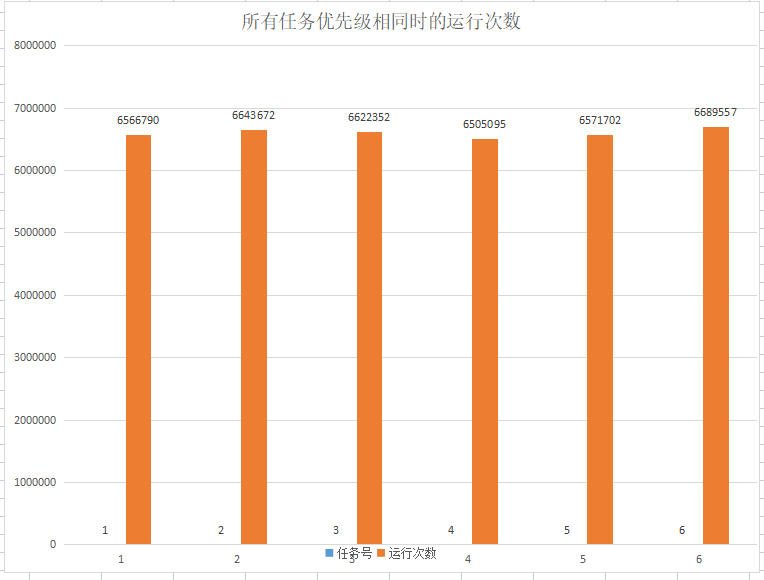
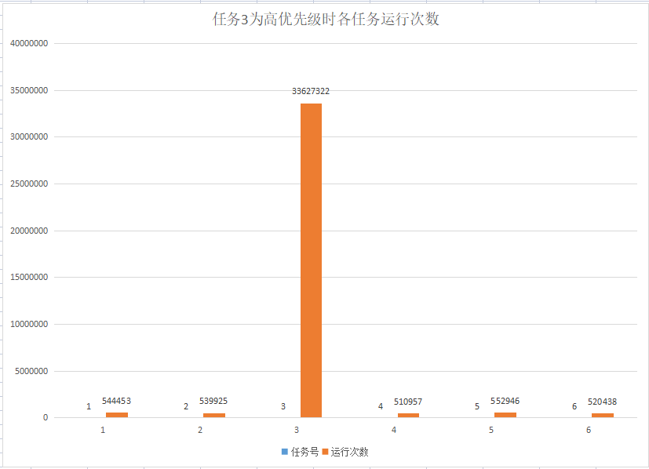
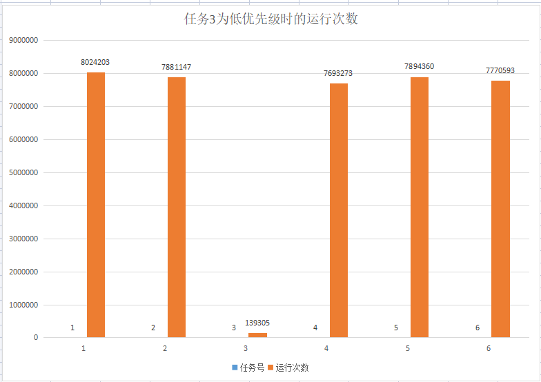
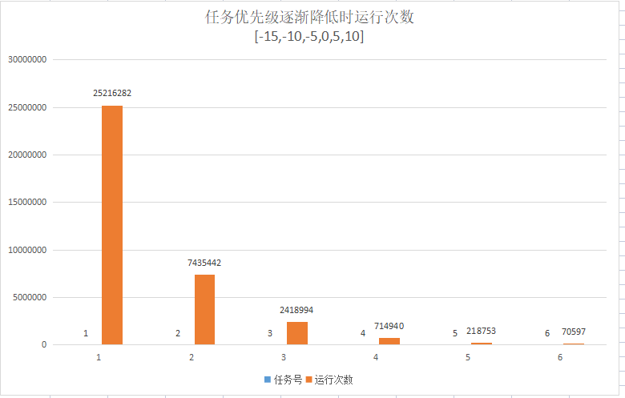
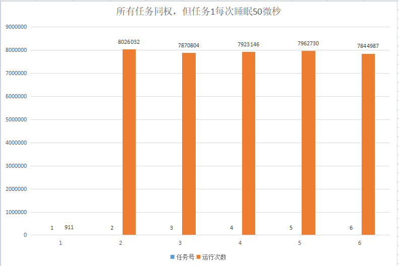

# 1.阅读《[A stack-less Rust coroutine library under 100 LoC](https://blog.aloni.org/posts/a-stack-less-rust-coroutine-100-loc/)》和《[200行实现绿色线程](https://zjp-cn.github.io/os-notes/green-thread.html)》

# 2.任务2实践任务
## 2.1 设计思路
1. 以文件《[A stack-less Rust coroutine library under 100 LoC](https://blog.aloni.org/posts/a-stack-less-rust-coroutine-100-loc/)》为基础，将上周代码中的CFS优先级算法，稍加改进，实现对Futures执行流的优先级调度。
## 2.2 源码路径

[priority100loc优先级的改造代码](task2/code/priority100loc/)

## 2.3 测试方式
1. 文档《[A stack-less Rust coroutine library under 100 LoC](https://blog.aloni.org/posts/a-stack-less-rust-coroutine-100-loc/)》中Future和执行器的源码增加执行流的优先级控制。测试使用6个异步任务（即6个执行流），每次测试设置不同优先级权重（-19~20），让执行器运行30秒后退出，每个任务执行的次数，即代表其优先级高低，除去最后一个测试，其它测试任务都是执行次数越多，说明优先级越高。图表中横坐标代表6个任务的编号，纵坐标代表每个任务执行的次数。
2. 最后一个测试，是让某一个任务执行时间显著长于其它任务（每次执行睡眠 50微秒），这样单个任务执行时间加长，运行次数就应该下降。
## 2.4 测试结果
1. 所有任务**优先级相同**。结果：6个任务运行的次数大体相同。

2. 将“任务3”的**优先级提升**（设为-18）。结果：可以看到任务3的运行次数显著**高**于其它任务。

3. 将“任务3”的**优先级降低**（设为18）。结果：可以看到任务3的运行次数显著**低**于其它任务。

4. 将任务的优先级设为逐渐下降(-15, -10, -5, 0, 5, 10)。结果：可以看到运行次数与优先级对应，逐渐下降。

5. 所有任务优先级相同，但“任务1”每次执行都睡眠50微秒再返回。结果：任务1单次执行时间增加，运行次数减少（为911次）。将单次睡眠时间×运行次数约为0.05秒，远小于平权的总运行时间5秒。我分析的原因：(1)rust标准库文档说sleep函数只是保证最少睡眠时间参数设置的时间，实际运行时每次睡眠了更长时间，积累放大了结果；(2)sleep睡眠时是整个进程被挂起然后再激活，这种切换可能也有一些时间消耗；(3)用户态缺乏精准的时钟，时间的计量可能有误差；(4)操作系统和其它进程也也在并发运行，占用系统时间。

## 2.5 结论
1. 精细的优先级控制需要精准的时钟配合才能实现，用户态只能进行近似拟合。
2. Future的yield机制主动让权的时间不固定，实际是以**牺牲确定性为代价**来获得性能和灵活性的提升，所以它不太适合确定性要求较高的场合，并且其性能优势很大程度依赖反射器或唤醒机制的合理设计。
# 3.阅读embassy文档
# 4. 下周安排
1. 想明白基于协程的调度器大体该怎么做，剩下两周又能做点什么。